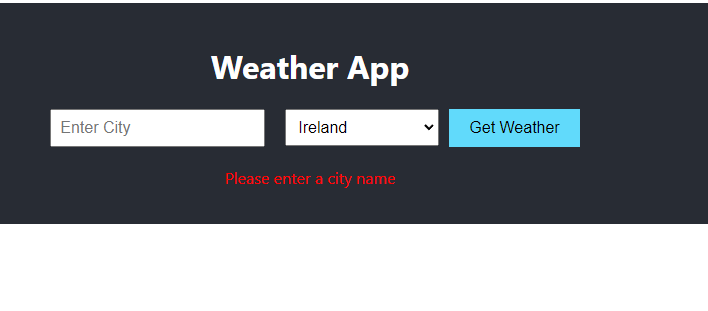
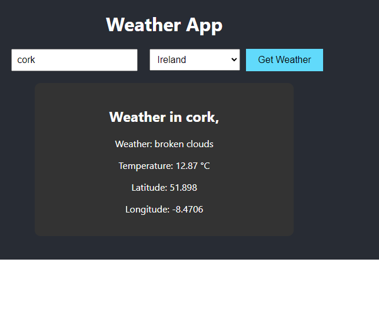
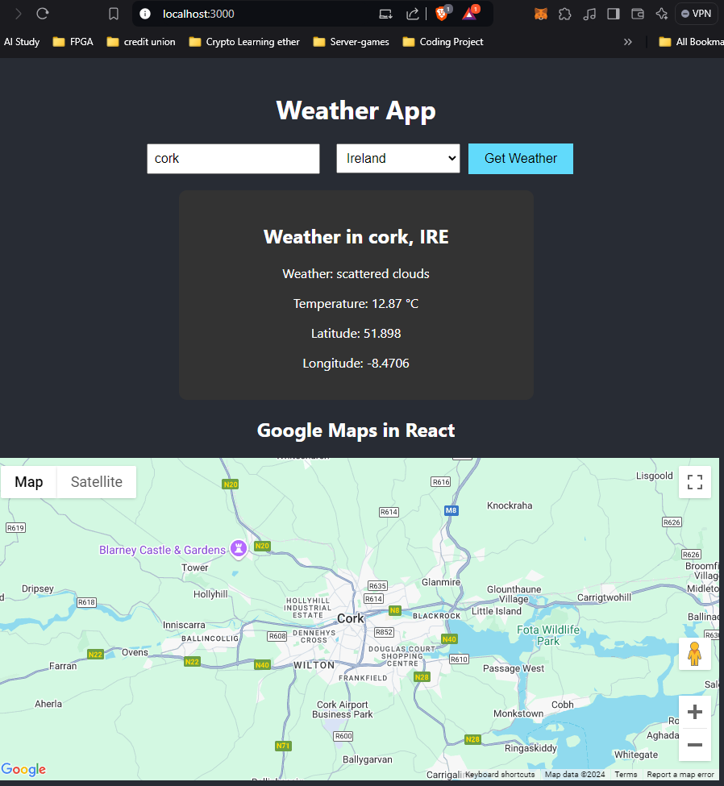

<h1>Weather Station News</h1>

<h1 id="contents">Table of Contents</h1>

- [1.Intro](#1.intro)
- [2.Design](#2.Design)
  - [2.1.React Starting](#2.1.React)
- [3.Implementation](#3.Implementation)
- [4.Project Design](#4.ProjectDesign)

 
<h1 id="1.intro">Project Introduction - News Report</h1>

In this section we have been asked to split the work into a front end and a back end, back end being java and api calls. This project will be our dispaly of how our customers or users will use it from a browser view point.  
 
For this we have chnaged the port numbers, our news front will communicate to the endpoint of the port number springboot java is using. 

<h1 id="2.Design">2.Design</h1>

<h2 id="2.1.React">2.1.React</h2>

<h2 id="2.2.React">2.1.GitHub repo 2</h2>

Commands ran once we had created our new repo and need to update

command:
git status                   # Check the status
git add app.js style.css      # Add only the modified files
git commit -m "Updated app functionality and CSS"   # Commit with a message
git push origin master        # Push the changes
 

<h1 id="3.Implementation">3.implementation</h1>

In this we need to create our new code in the src file

<h2 id="3.1.UI">3.1.UI</h2>

   
we tested this and it now shows the error 
   

so now we can test this and see what details are presented. 

   

Next we can now readd the maps. 

<h1 id="4.Design">4.Adding more features.....Like maps</h1>

Our code results now show the following map location again using the result from our api weather with lat and long. 

   
